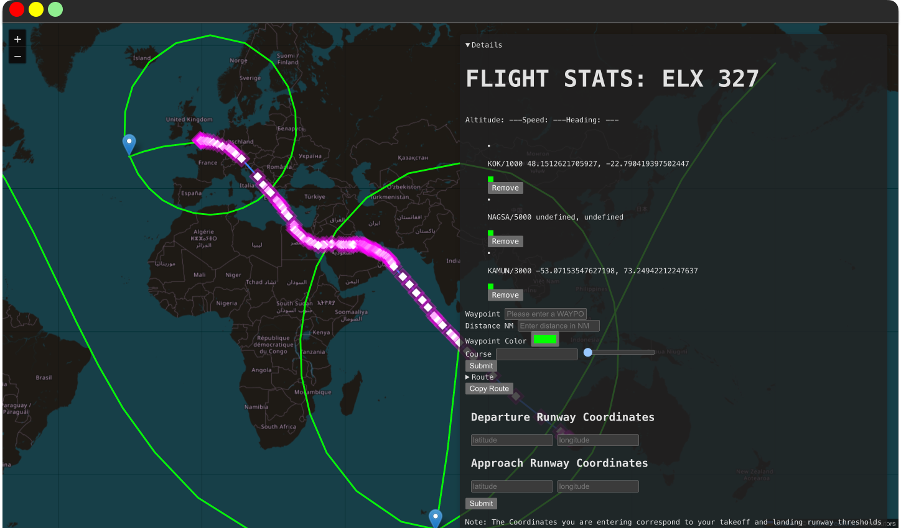

# GEFS-radial-bearing [](https://github.com/pylint-dev/pylint)





# **DISCLAIMER: DO NOT USE FOR REAL WORLD NAVIGATION**
There is absolutely no guarantee that this information is accurate to real world aviation

Dev Branch: 

Main Branch:  


A mapping application that works with [GeoFS](https://www.geo-fs.com/) and [Simbrief](https://www.simbrief.com/home/) to provide route information to enhance
situational awareness in the cockpit, working with any aircraft that is both available in Geofs and Simbrief. It allows creation of radials with magnetic bearing, adjusted with the [WMM](https://www.ncei.noaa.gov/products/world-magnetic-model) model, being accurate up to 2025. It allows for departure and runway selection, seamlessly generated flight plans that easily work with the existing [fmc-requirejs](https://github.com/gefs-plugins/fmc-requirejs) plugin and [autopilot_pp](https://github.com/Qantas94Heavy/autopilot-pp) plugins for GeoFS. With the addition of fix rings, like in real aircraft it allows the pilot to stay ahead for the aircraft. Coupled with [OSM](https://www.openstreetmap.org)

* [x] Does not require any special authentication
* [x] Works with any AIRAC
* [x] Works cross-platform
* [x] Allows visualization of complex radii and magnetic courses on a flat map with considerable accuracy

## Getting Started

These instructions will get you a copy of the project up and running on your local machine for development and testing purposes. See deployment for notes on how to deploy the project on a live system.

### Prerequisites
* [Node.js](https://nodejs.org)
* [Python 3.12.2](http://python.org)
* [Tampermonkey](https://www.tampermonkey.net/),
* [Greasemonkey(*Firefox Only*)](https://addons.mozilla.org/en-US/firefox/addon/greasemonkey/)
* or [ViolentMonkey](https://violentmonkey.github.io/)
* [autopilot_pp](https://github.com/Qantas94Heavy/autopilot-pp)
* [fmc-requirejs](https://github.com/gefs-plugins/fmc-requirejs)


### Installing
**NOTE: After installing any userscript addon, please ensure that you allow access to file URLs for that extension in your browser settings**

Drag and drop the `userscript.js` file into a empty "New Tab" window, which will be recognized by the userscript manager. Click install to install the script and your are done!


Creating a [python virtual environment](https://docs.python.org/3/library/venv.html) is *not required*, it is **highly reccommended**.

After activating the virtual environment, run:
```
pip3 install -r requirements.txt
```
This installs all the required python packages to run the server which will be connected to the Geofs usescript. In `app.py` replace `USERID` with your Simbrief Pilot ID. In `geofs-interface/src/worker.ts` replace `userId` with your Simbrief Pilot ID. *If you don't do this, you'll just be loading my flightplans*

```
cd geofs-interace
```
and then run
```
npm install
```
This installs all the required dependencies for this app

Now that you have all the required dependencies, run two commands on two seperate terminals:
```
npm run dev
```
in the geofs-interface folder
and
```
python3 app.py
```
in the main folder. Starting:
* a server on http://localhost:5000
* and the app on http://localhost:5173

Start [Geofs](https://www.geo-fs.com/geofs.php) after opening the app, ensure the [fmc-requirejs](https://github.com/gefs-plugins/fmc-requirejs) and [autopilot_pp](https://github.com/Qantas94Heavy/autopilot-pp) are installed.

**NOTE: On macOS, disable the 'AirPlay Receiver' service from System Preferences -> General -> AirDrop & Handoff.**

**NOTE: If you want the route clipboard feature to be available, you can only run as localhost or 127.0.0.1, which are considered to be [secure contexts](https://developer.mozilla.org/en-US/docs/Web/Security/Secure_Contexts) although they use the HTTP protocol. Read more [here](https://akshitb.medium.com/how-to-run-https-on-localhost-a-step-by-step-guide-c61fde893771) on how to make localhost or even the adress on your LAN HTTPS compliant**


### And coding style tests
We use [pylint](https://pylint.readthedocs.io/). It is implemented as a github action. No actions are neeeded from your side. We use pylint to ensure our code is less prone to errors, because it is meant to replicate standards of real flight navigation apps like [Navigraph FliteDeck Pro](https://ww2.jeppesen.com/navigation-solutions/flitedeck-pro/). We will not merge your pull request if the pylint test failed


## Built With

* [Leaflet](https://leafletjs.com/examples.html) - Map library
* [OpenStreetMap](https://openstreetmap.org) - Map tile service
* [Leaflet.RotatedMarker](https://github.com/bbecquet/Leaflet.RotatedMarker/) - Library for providing Leaflet markers that are able to rotate
* [Leaflet.Geodesic](https://github.com/henrythasler/Leaflet.Geodesic) - Library to draw geodesic lines on leaflet maps
* [Vite](https://vitejs.dev) - Very easy development and fast HMR


## Versioning

We use [SemVer](http://semver.org/) for versioning. For the versions available, see the [tags on this repository](https://github.com/Tech-Helper503/GEFS-radial-bearing/tags).

## Contributing

Please read [CONTRIBUTING.md](CONTRIBUTING.md) for details on our code of conduct, and the process for submitting pull requests to us.

## Authors

* **Aiden Israel** - *Initial work* - [Tech-Helper503](https://github.com/Tech-Helper503)


## License

This project is licensed under the MIT License - see the [LICENSE.md](LICENSE.md) file for details
